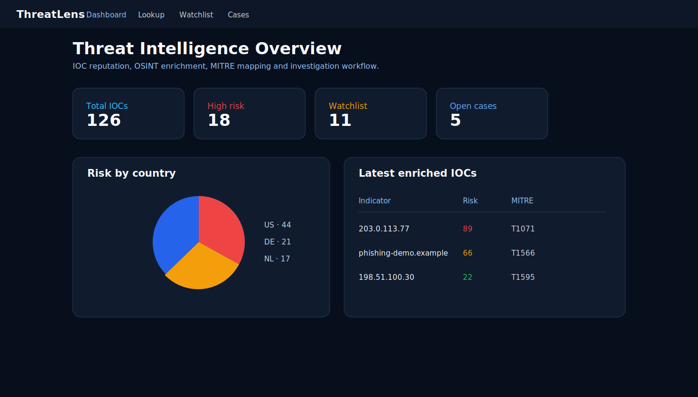
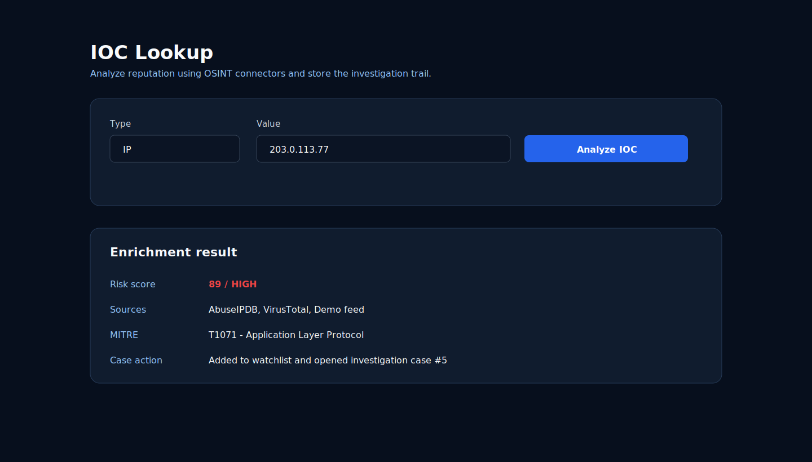

# ThreatLens

ThreatLens is a threat intelligence and OSINT platform for checking indicators of compromise (IOCs), calculating risk, correlating signals and generating analyst-friendly exports.

It complements SIEM-style projects: a SIEM detects suspicious activity, while ThreatLens enriches suspicious IPs, domains, URLs and hashes with reputation data.

## Project Identity

**ThreatLens** is a Threat Intelligence / OSINT portfolio project focused on IOC reputation lookup, enrichment history, analyst watchlists and investigation case management.

## Screenshots

The screenshots below use sanitized demo data and documentation IP ranges.

### Threat intelligence dashboard



### IOC lookup and enrichment



## Features

- JWT authentication with admin, analyst and viewer roles
- IOC lookup for IP, domain, URL and hash indicators
- Optional AbuseIPDB and VirusTotal integrations
- Python FastAPI analyzer microservice
- MITRE ATT&CK technique mapping for enriched indicators
- IOC watchlist for indicators that require monitoring
- True positive / false positive verdict field for triage
- Case management for analyst investigations
- Reputation snapshot history per indicator
- Basic external feed import endpoint for IOC lists
- Risk scoring from 0 to 100 with LOW, MEDIUM and HIGH severity
- PostgreSQL persistence for indicators, lookups, feeds, alerts and reports
- Realtime alert notifications with Socket.IO
- Dashboard with KPI cards, severity chart, latest alerts and IOC timeline
- CSV and JSON report exports
- Docker Compose for local full-stack execution
- GitHub Actions CI for backend, analyzer and frontend

## Tech Stack

| Layer | Technology |
| --- | --- |
| Frontend | React, TypeScript, Recharts, Socket.IO Client, Vite |
| Backend | Node.js, Express, TypeScript, Prisma, JWT |
| Analyzer | Python, FastAPI, OSINT connectors |
| Database | PostgreSQL |
| DevOps | Docker, Docker Compose, GitHub Actions |

## Architecture

```text
React Dashboard
  |
  v
Node.js API + Socket.IO
  |
  +--> PostgreSQL
  |
  v
Python FastAPI Analyzer
  |
  +--> AbuseIPDB / VirusTotal / Demo Risk Engine
```

## Project Structure

```text
threatlens/
|-- backend-node/
|   |-- src/
|   |   |-- modules/
|   |   |-- middlewares/
|   |   |-- config/
|   |   `-- server.ts
|   |-- prisma/
|   |-- Dockerfile
|   `-- package.json
|-- analyzer-python/
|   |-- app/
|   |-- Dockerfile
|   `-- requirements.txt
|-- frontend/
|   |-- src/
|   |-- Dockerfile
|   `-- package.json
|-- docker-compose.yml
`-- README.md
```

## Run with Docker

```bash
docker compose up --build
```

Open:

```text
Frontend: http://localhost:5175
Backend:  http://localhost:3000
Analyzer: http://localhost:8002
```

Seed the default admin after the backend container is running:

```bash
docker compose exec backend-node npm run seed
```

Default credentials:

```text
Email: admin@threatlens.local
Password: Admin1234
```

## Testing

- Backend TypeScript production build.
- Frontend production build with Vite.
- Python analyzer syntax validation.
- Docker Compose configuration validation.
- Recommended next tests: IOC lookup, RBAC permissions, alert creation, watchlist items and case lifecycle.

## Run Locally

Backend:

```bash
cd backend-node
npm install
copy .env.example .env
npx prisma db push
npm run seed
npm run dev
```

Analyzer:

```bash
cd analyzer-python
py -3 -m venv .venv
.venv\Scripts\activate
pip install -r requirements.txt
uvicorn app.main:app --reload --port 8002
```

Frontend:

```bash
cd frontend
npm install
npm run dev
```

## API Examples

Analyze an IP:

```json
{
  "type": "IP",
  "value": "203.0.113.42"
}
```

Analyze a suspicious domain:

```json
{
  "type": "DOMAIN",
  "value": "malware-demo.example"
}
```

## Useful Endpoints

| Method | Endpoint | Description |
| --- | --- | --- |
| POST | `/auth/login` | Sign in and receive JWT |
| POST | `/auth/register` | Admin-only user creation |
| POST | `/lookups` | Analyze an IOC |
| GET | `/lookups` | Lookup history |
| GET | `/lookups/:indicatorId/history` | Reputation history for an IOC |
| GET | `/indicators` | Stored IOC inventory |
| GET | `/alerts` | Threat intelligence alerts |
| GET | `/watchlist` | Analyst IOC watchlist |
| POST | `/watchlist` | Add IOC to watchlist |
| GET | `/cases` | Investigation cases |
| POST | `/cases` | Open investigation case |
| POST | `/feeds/import` | Import a simple IOC feed |
| GET | `/dashboard` | Dashboard metrics |
| GET | `/reports/indicators.csv` | CSV IOC export |
| GET | `/reports/summary.json` | JSON summary export |

## Railway / Vercel Deployment

Deploy this monorepo as separate services:

| Service | Platform | Root directory |
| --- | --- | --- |
| Backend API | Railway | `backend-node` |
| Python Analyzer | Railway | `analyzer-python` |
| Frontend | Vercel or Railway | `frontend` |

Backend variables:

```env
DATABASE_URL=<Railway PostgreSQL URL>
JWT_SECRET=<long-random-secret>
JWT_EXPIRES_IN=7d
ALLOWED_ORIGINS=<frontend-url>
ANALYZER_URL=<python-analyzer-url>
```

Analyzer variables:

```env
ABUSEIPDB_API_KEY=<optional>
VIRUSTOTAL_API_KEY=<optional>
```

Frontend variable:

```env
VITE_API_URL=<backend-api-url>
```

## Security Notes

- Use the demo lookup mode for portfolio screenshots when you do not want to expose real API keys.
- Do not commit `.env` files.
- Only check indicators and threat feeds that you are allowed to analyze.

## What I Learned

- Threat intelligence workflows and IOC enrichment.
- OSINT-style analyzer service design.
- JWT authentication with admin, analyst and viewer roles.
- PostgreSQL modeling for indicators, lookups, alerts, reports, watchlists and cases.
- MITRE ATT&CK mapping as analyst context.
- Realtime alert delivery with Socket.IO.
- Dockerized multi-service architecture for backend, analyzer, database and frontend.

## License

MIT License.
